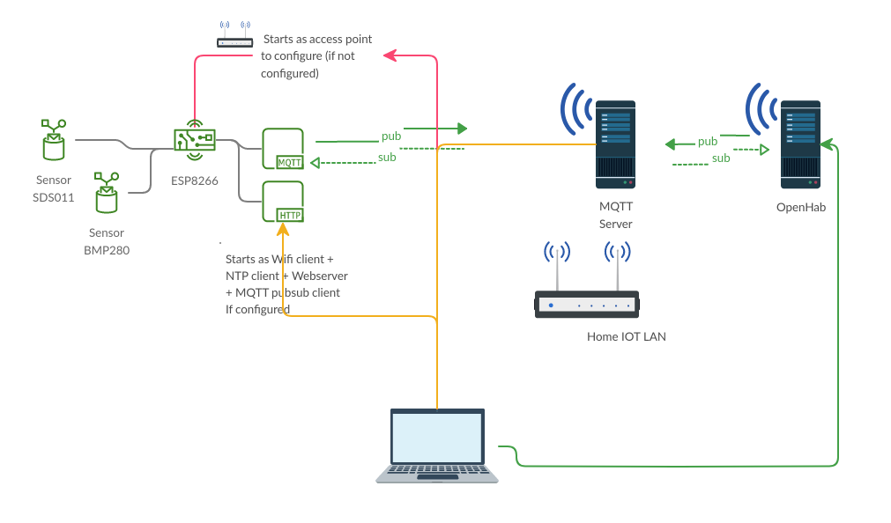
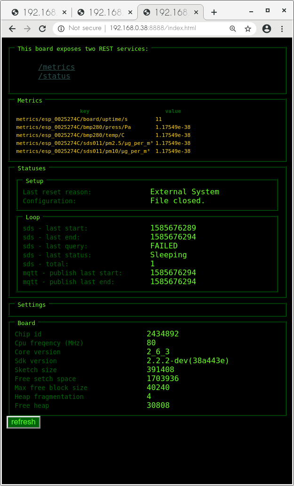
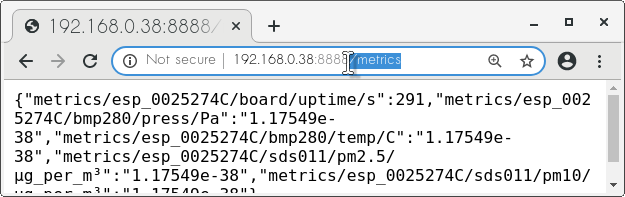
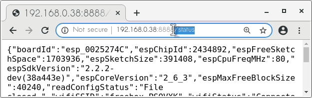

<em><center>__WORK ONGOING__</center></em>

# myEsp8266IOT #
## Global picture ##



Configures a ESP8266 board to
* Expose a configuration access point (when not configured)
* Collects metrics from connected sensors.
* Push metrics to a remote MQTT server.
* Expose metrics in REST and web UI (for debug purpose).

In debug mode, missing metrics are published as ```FLT_MIN```

## MQTT ##
Metrics are published into MQTT
```
<configurable publish root>/<board ID>/<sensor ID>/<metric>/<units>
```
## Web ##
* ```/metrics``` and ```/status``` json rest services are available
* A dynamic ```/index.html``` UI expose board informations.

Pictures taken with a __naked board : no sensor connected__ :)





